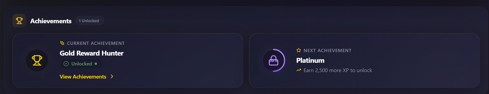

# 🏆 VELOOP Rewards - User Profile

[](https://reactjs.org/)
[](https://vitejs.dev/)
[](https://github.com/css-modules/css-modules)
[](https://lucide.dev/)

> **A Premium Gamified + Fintech User Profile Experience**

---

## 📌 Project Overview

The VELOOP Rewards User Profile is a complete redesign of the user profile page for a gamified rewards platform. It combines **fintech professionalism** with **gamification elements** to create an engaging, trust-inspiring experience.

### 🎯 The Vision

> *"This is my VELOOP identity, my progress, my rewards, and my achievements."*

The profile serves as the user's **command center** where they can:
- 👤 **Identify** - Who am I?
- 🎁 **Rewards** - What have I earned?
- 📈 **Progress** - How far have I come?
- 🏆 **Achievements** - What have I unlocked?
- 💰 **Withdrawals** - What have I redeemed?
- 👥 **Referrals** - How am I growing?
- ⚡ **Actions** - What can I do next?

---

## 📸 Screenshots

## 📸 Screenshots

### Desktop Views


Profile Hero Section


Profile Identity Section


Reward Assets Section


Level Progress Section


Achievements Section


Withdrawal Overview Section


Quick Actions Section


Referral Snapshot Section


Recent Activity Section


Account Information Section

---

### Mobile Views


*Mobile View 1*


*Mobile View 2*


*Mobile View 3*


*Mobile View 4*


*Mobile View 6*


*Mobile View 7*
---

### 📊 Component Preview

| Component | Preview |
|-----------|---------|
| **Profile Hero** | Avatar, Name, Level, XP Progress, Status Badge |
| **Profile Identity** | User ID, Email, Referral Code, Member Since, Account Status |
| **Reward Assets** | VEs, SVEs, Gems, Tokens, XP Cards |
| **Level Progress** | Animated XP Bar, Milestones, Level Badge |
| **Achievements** | Current Achievement, Next Achievement with Progress |
| **Withdrawal Overview** | Total Amount, Stats Cards, Status Indicators |
| **Quick Actions** | 6 Interactive Action Cards |
| **Referral Snapshot** | Referral Code, Stats, Milestone Progress |
| **Recent Activity** | Orbit Carousel with Activity List |
| **Account Information** | Account Fields, Security, Trust Message |

---

### 🎨 Design Highlights

| Feature | Description |
|---------|-------------|
| **Glassmorphism** | Blur effects with transparency |
| **Animated Borders** | Rotating gradient borders |
| **Floating Particles** | Gold particles animation |
| **Orbit Effects** | Moving dots around circles |
| **3D Hover** | Card tilt and elevation |
| **Smooth Transitions** | Staggered animations |
| **Dark Theme** | Premium navy/gold color scheme |
| **Responsive** | Mobile → Tablet → Desktop |

---

### 📱 Responsive Behavior

| Breakpoint | Layout | Behavior |
|------------|--------|----------|
| **> 1440px** | Full Desktop | 2 columns, full features |
| **1280px - 1440px** | Desktop | 2 columns, optimized spacing |
| **1024px - 1280px** | Laptop | 2 columns, compact |
| **768px - 1024px** | Tablet | 2 → 1 columns |
| **480px - 768px** | Mobile | Single column |
| **< 480px** | Small Mobile | Single column, compact |


## ✨ Features

### 🎨 Profile Hero
- Dynamic avatar with initials fallback
- User name with sparkle animation
- Level badge with crown icon
- Animated XP progress bar
- Account status indicator

### 🆔 Profile Identity
- Premium information cards with icons
- User ID with copy functionality
- Email address display
- Referral code with copy functionality
- Member since date
- Account status with verification badges
- Security status indicators

### 💰 Reward Assets
- **VEs** (Gold theme) - Primary reward currency
- **SVEs** (Silver theme) - Premium reward currency
- **Gems** (Cyan theme) - Collectible rewards
- **Tokens** (Purple theme) - Platform utility tokens
- **XP** (Orange theme) - Experience points
- Each asset has distinct visual identity
- Tooltips with information icons
- Clickable action buttons

### 📊 Level Progress
- Animated XP progress bar
- Milestone markers (25%, 50%, 75%, 100%)
- Level badge with dynamic icon
- XP to next level display
- Progress messages

### 🏆 Achievements
- Current achievement with unlocked status
- Next achievement with progress ring
- Orbiting dot animation (like hero section)
- View achievements CTA

### 💳 Withdrawal Overview
- Total amount withdrawn (prominent)
- Stat cards (Total Requests, Approved, Pending, Failed)
- Visual progress bar with status colors
- Status indicators (Green, Amber, Red)

### ⚡ Quick Actions
- 6 interactive action cards
- Get More Gems
- Earn More Rewards
- Watch Ads
- Refer Friends
- Redeem Rewards
- Achievements
- Hover animations (elevation, icon movement)

### 👥 Referral Snapshot
- Referral code with copy functionality
- Total referrals count
- Referral rewards display
- Referral XP bonus
- Milestone progress bar

### 📋 Recent Activity
- Orbit carousel with auto-play
- Activity list with icons
- Earn/Spend/Achievement indicators
- Timestamps
- Total earned/spent stats

### 🔐 Account Information
- Expandable section
- Account fields with copy
- Security status indicators
- Quick action buttons
- Trust message

### 🎮 Animations & Effects
- Glassmorphic card design
- Animated gradient borders
- Floating particles and orbs
- Staggered section appearances
- Hover effects with elevation
- XP progress animation
- Count-up animations
- Shine effects on cards
- Orbit carousel with auto-play

### 📱 Responsive Design
- Mobile (320px+)
- Tablet (768px+)
- Laptop (1280px+)
- Desktop (1440px+)
- Large screens (1920px+)

---

## 🛠️ Technology Stack

| Technology | Purpose |
|------------|---------|
| **React 18** | UI Framework |
| **Vite** | Build Tool |
| **CSS Modules** | Component Styling |
| **Lucide React** | Icons |
| **React Hooks** | State Management |

---

## 📁 Folder Structure
```bash
src/
├── components/
│ ├── AccountInformation/
│ │ ├── AccountInformation.jsx
│ │ └── AccountInformation.module.css
│ ├── AchievementCard/
│ │ ├── AchievementCard.jsx
│ │ └── AchievementCard.module.css
│ ├── LevelProgress/
│ │ ├── LevelProgress.jsx
│ │ └── LevelProgress.module.css
│ ├── ProfileEmptyState/
│ │ ├── ProfileEmptyState.jsx
│ │ └── ProfileEmptyState.module.css
│ ├── ProfileHero/
│ │ ├── ProfileHero.jsx
│ │ └── ProfileHero.module.css
│ ├── ProfileIdentity/
│ │ ├── ProfileIdentity.jsx
│ │ └── ProfileIdentity.module.css
│ ├── ProfileSkeleton/
│ │ ├── ProfileSkeleton.jsx
│ │ └── ProfileSkeleton.module.css
│ ├── QuickActions/
│ │ ├── QuickActions.jsx
│ │ └── QuickActions.module.css
│ ├── RecentActivity/
│ │ ├── RecentActivity.jsx
│ │ └── RecentActivity.module.css
│ ├── ReferralSnapshot/
│ │ ├── ReferralSnapshot.jsx
│ │ └── ReferralSnapshot.module.css
│ ├── RewardAssets/
│ │ ├── RewardAssets.jsx
│ │ ├── RewardAssets.module.css
│ │ ├── VEsCard/
│ │ │ ├── VEsCard.jsx
│ │ │ └── VEsCard.module.css
│ │ ├── SVEsCard/
│ │ │ ├── SVEsCard.jsx
│ │ │ └── SVEsCard.module.css
│ │ ├── GemsCard/
│ │ │ ├── GemsCard.jsx
│ │ │ └── GemsCard.module.css
│ │ ├── TokensCard/
│ │ │ ├── TokensCard.jsx
│ │ │ └── TokensCard.module.css
│ │ └── XPCard/
│ │ ├── XPCard.jsx
│ │ └── XPCard.module.css
│ └── WithdrawalOverview/
│ ├── WithdrawalOverview.jsx
│ └── WithdrawalOverview.module.css
├── data/
│ ├── activityData.js
│ ├── index.js
│ ├── rewardsData.js
│ ├── userData.js
│ └── withdrawalData.js
├── hooks/
│ ├── index.js
│ ├── useCopyToClipboard.js
│ ├── useCountUp.js
│ ├── useIntersectionObserver.js
│ └── useWindowSize.js
├── pages/
│ └── UserProfile/
│ ├── UserProfile.jsx
│ └── UserProfile.module.css
├── styles/
│ └── global.css
├── App.jsx
├── index.css
└── main.jsx

```


---

## 🚀 Installation & Setup

### Prerequisites
- Node.js (v16 or higher)
- npm or yarn

### Installation

```bash
# Clone the repository
git clone https://github.com/Sara12-2/VELoop_Rewards-User-Profile

# Navigate to project directory
cd VELoop_Rewards-User-Profile

# Install dependencies
npm install

# Start development server
npm run dev
```

## Development Commands
```bash
# Start development server
npm run dev

# Build for production
npm run build

# Preview production build
npm run preview

# Lint code
npm run lint

```
# VELOOP Rewards — Profile Page

## 🎨 Design System

### Color Palette

| Color          | Hex                 | Usage              |
| -------------- | ------------------- | ------------------ |
| Background     | `#0f1020 → #1a1b2e` | Main page gradient |
| Gold Primary   | `#FFD700`           | Primary accent     |
| Gold Secondary | `#FFA500`           | Secondary accent   |
| Purple         | `#8B5CF6`           | Achievement accent |
| Blue           | `#3B82F6`           | Info accent        |
| Pink           | `#EC4899`           | Soft accent        |
| Teal           | `#14B8A6`           | Fresh accent       |
| Green          | `#81C784`           | Success states     |
| Red            | `#E57373`           | Danger states      |
| Amber          | `#FFB74D`           | Warning states     |
| Silver         | `#C0C0C0`           | SVEs accent        |

### Typography

* **Font Family:** Inter (Google Fonts)
* **Font Weights:** 300, 400, 500, 600, 700, 800, 900

### Effects

* **Glassmorphism:** Backdrop blur + transparency
* **Glow Effects:** Box-shadow with gold tint
* **Animations:** CSS keyframes with cubic-bezier
* **Transitions:** Smooth hover and state changes

---

## 📱 Responsive Behavior

| Device        | Breakpoint        | Layout                 |
| ------------- | ----------------- | ---------------------- |
| Small Mobile  | `< 480px`         | Single column, compact |
| Mobile        | `480px – 768px`   | Single column          |
| Tablet        | `768px – 1024px`  | 2 columns              |
| Laptop        | `1024px – 1280px` | 2 columns              |
| Desktop       | `1280px – 1440px` | Full layout            |
| Large Desktop | `> 1440px`        | Full layout            |

---

## 🏗️ Component Architecture

### Core Components

```text
UserProfile (Page)
├── ProfileHero
├── ProfileIdentity
├── RewardAssets
│   ├── VEsCard
│   ├── SVEsCard
│   ├── GemsCard
│   ├── TokensCard
│   └── XPCard
├── LevelProgress
├── AchievementCard
│   ├── CurrentAchievement
│   └── NextAchievement
├── WithdrawalOverview
├── QuickActions
├── ReferralSnapshot
├── RecentActivity
└── AccountInformation
```

### Utility Components

* `ProfileSkeleton` — Loading state
* `ProfileEmptyState` — Empty/Error state

### Custom Hooks

* `useCountUp` — Animated number counting
* `useCopyToClipboard` — Copy functionality
* `useIntersectionObserver` — Scroll animations
* `useWindowSize` — Responsive behavior

---


---

### 🎯 User Journey Flow

---

## 🔗 Live Demo

🔴 **View Live Demo**

https://ve-loop-rewards-user-profile.vercel.app/

---

## 📦 GitHub Repository

🔗 **GitHub Repository**

https://github.com/Sara12-2/VELoop_Rewards-User-Profile

---

## 👨‍💻 Author

**Your Name**

* GitHub: `Sara12-2`
* LinkedIn: Sara Manzoor

---

## 📝 License

This project is proprietary and confidential.

---

## 🙏 Acknowledgments

* Unsplash for background images
* Lucide for icons
* VELOOP Rewards for the opportunity

---

## 📊 Project Status

| Feature             | Status     |
| ------------------- | ---------- |
| Profile Hero        | ✅ Complete |
| Profile Identity    | ✅ Complete |
| Reward Assets       | ✅ Complete |
| Level Progress      | ✅ Complete |
| Achievements        | ✅ Complete |
| Withdrawal Overview | ✅ Complete |
| Quick Actions       | ✅ Complete |
| Referral Snapshot   | ✅ Complete |
| Recent Activity     | ✅ Complete |
| Account Information | ✅ Complete |
| Loading State       | ✅ Complete |
| Empty State         | ✅ Complete |
| Error State         | ✅ Complete |
| Responsive Design   | ✅ Complete |
| Animations          | ✅ Complete |
| Accessibility       | ✅ Complete |

---

## 🎯 User Journey

```text
Earn → Collect → Progress → Achieve → Redeem → Return
```

The design motivates users while maintaining professional trustworthiness.

---

